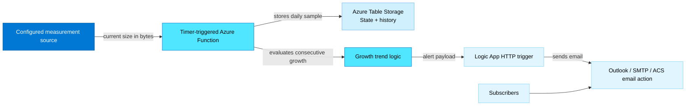
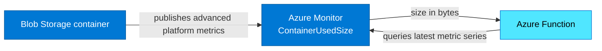
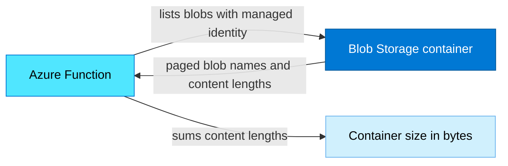

# Azure Blob Storage Growth Monitor

A .NET 10 isolated-worker Azure Function that checks one Blob Storage
container daily and invokes a Logic App webhook when the container grows for
a configurable number of consecutive calendar days.

## Architecture

The measurement source is configurable, while history storage, growth
evaluation, and notification behavior are shared by both implementations.



1. The timer-triggered Function obtains the current container size from the
   configured measurement source.
2. One idempotent sample per UTC date is stored in Azure Table Storage.
3. The Function evaluates consecutive calendar-day increases.
4. A Logic App webhook receives an alert payload and sends email to the
   configured subscribers.
5. Alert state prevents duplicate email while the same growth streak
   continues. A non-growing day resets the state.

### Azure Monitor metrics

Set `GrowthMonitor__MeasurementSource` to `AzureMonitorMetrics` to query the
`ContainerUsedSize` advanced platform metric. The Function sums the latest
values across blob type and access tier series. This avoids scanning every
blob, but advanced platform metrics are currently in preview and metric data
can take time to appear.



### Blob listing

Set `GrowthMonitor__MeasurementSource` to `BlobListing` to use generally
available Blob service APIs instead of preview metrics. The Function pages
through the container, counts live blobs, and sums each blob's `ContentLength`.
This scans the whole container on every run, so large containers take longer
and incur list-operation transactions. Snapshots, versions, and soft-deleted
blobs are not included.



## Prerequisites

- .NET 10 SDK
- Azure Functions Core Tools v4 for local execution
- Azure CLI for deploying Azure infrastructure and, when selected, enabling
  advanced platform metrics
- Azurite for local Function host and Table Storage
- A Blob Storage account with advanced platform metrics enabled when using
  `AzureMonitorMetrics`
- A state storage account with Table service
- A Logic App with an HTTP request trigger and an email action

.NET 10 is supported by Azure Functions runtime v4 in the isolated worker
model through November 14, 2028. It isn't supported on the legacy Linux
Consumption plan; use Flex Consumption, Premium, Dedicated, or another
supported hosting option.

## Enable the container metric

```powershell
az storage advanced-platform-metric create `
  --resource-group <resource-group> `
  --account-name <storage-account> `
  --enabled `
  --rule-config-filter-type ContainerListFilter `
  --rule-config-filter-values <container-name>
```

Metric data can take up to six hours to appear after the rule changes.

## Azure permissions

Enable a managed identity on the Function App and grant it:

- **Monitoring Reader** on the monitored storage account when using
  `AzureMonitorMetrics`.
- **Storage Blob Data Reader** on the monitored storage account when using
  `BlobListing`.
- **Storage Table Data Contributor** on the state storage account.

The code uses `ManagedIdentityCredential` in Azure and
`DefaultAzureCredential` during local development. Do not store storage keys
or credentials in settings.

The Function App only has a user-assigned managed identity attached, not a
system-assigned one, so `ManagedIdentityCredential` must be told which
identity to use. The `AZURE_CLIENT_ID` app setting (populated by the Bicep
deployment from the user-assigned identity's client ID) is required; without
it, authentication fails with "Unable to load the proper Managed Identity".

Because the state storage account has shared key access disabled, viewing its
blob deployment package or `BlobGrowthHistory` table in the Azure Portal or
Azure Storage Explorer requires an Entra ID data-plane role. Set the Bicep
parameter `resourceOwnerPrincipalId` to a user, group, or service principal
object ID to grant it **Storage Blob Data Reader** and **Storage Table Data
Contributor** on that account (Contributor, not Reader, so the owner can also
delete or edit table rows). Leave it empty to skip this optional access.

## Configuration

Copy `src\AzBlobStorageMonitor.Functions\local.settings.sample.json` to
`local.settings.json` and replace the placeholders.

| Setting | Meaning |
|---|---|
| `GrowthMonitorSchedule` | NCrontab timer schedule; the sample runs daily at 00:15 UTC |
| `GrowthMonitor__MonitorName` | Stable unique key for this monitored container |
| `GrowthMonitor__StorageAccountResourceId` | Full Azure resource ID of the monitored account |
| `GrowthMonitor__ContainerName` | Container selected in the metric filter |
| `GrowthMonitor__MeasurementSource` | `AzureMonitorMetrics` (default) or `BlobListing` |
| `GrowthMonitor__BlobServiceUri` | Blob endpoint; required for `BlobListing` |
| `GrowthMonitor__HistoryTableServiceUri` | Managed-identity Table service endpoint |
| `GrowthMonitor__HistoryTableName` | Table used for samples and alert state |
| `GrowthMonitor__LogicAppWebhookUrl` | HTTP-trigger URL for the email Logic App |
| `GrowthMonitor__GrowthWindowDays` | Number of consecutive daily increases required; default `3` |
| `GrowthMonitor__MinimumDailyGrowthBytes` | Minimum increase required each day; default `0` |
| `GrowthMonitor__MetricLookbackHours` | Metric query lookback; default `24` |
| `GrowthMonitor__Subscribers__N` | One email address per numbered setting |
| `GrowthMonitor__SubscribersCsv` | Optional comma-separated subscriber list, used by the Bicep deployment |
| `AZURE_CLIENT_ID` | Client ID of the Function App's user-assigned managed identity; required in Azure so `ManagedIdentityCredential` selects the right identity |

To run a function manually from the Azure Portal (**Code + Test** ->
**Test/Run**), the Function App must allow the `https://portal.azure.com`
origin in CORS. The Bicep deployment sets this automatically; if it's
missing, add it with:

```powershell
az functionapp cors add --name <function-app-name> --resource-group <resource-group> --allowed-origins https://portal.azure.com
```

The Bicep parameter is named `measurementSource` and assigns only the role
needed by the selected implementation. `BlobListing` also requires network
access from the Function App to the monitored account's Blob service endpoint.

Three growth days require four consecutive daily measurements. For example,
100 GB, 110 GB, 120 GB, and 125 GB produce three daily increases.

Set `GrowthMonitor__GrowthWindowDays` to any positive integer. For example,
`5` requires six consecutive daily samples that contain five day-to-day
increases. The former `GrowthMonitor__ConsecutiveGrowthDays` setting remains
accepted as a backward-compatible alias.

## History storage and retention

The alert state uses one fixed Table Storage row per monitor and is replaced
on each update, so it does not grow over time. Daily size history uses one row
per monitor per UTC date. Repeated runs on the same date replace that day's
row, but each new date adds a row.

The current implementation does not delete old samples, so history grows by
approximately 365 rows per monitored container each year. Azure Table Storage
does not provide automatic per-row TTL. If long-term history is not required,
add scheduled cleanup or a retention setting that preserves at least
`GrowthWindowDays + 1` samples.

## Logic App request body

The Function posts JSON shaped like:

```json
{
  "monitorName": "meeting-record-monitor",
  "storageAccountResourceId": "/subscriptions/.../storageAccounts/example",
  "containerName": "archive",
  "subscribers": ["storage-operations@example.com"],
  "subject": "Blob container growth alert: archive",
  "summary": "Container grew for 3 consecutive days.",
  "totalGrowthBytes": 26843545600,
  "totalGrowthPercent": 25.0,
  "samples": [
    { "date": "2026-09-18", "sizeBytes": 107374182400 }
  ]
}
```

Use the `subscribers`, `subject`, and `summary` properties in an Outlook,
SMTP, or Azure Communication Services email action.

Treat the Logic App webhook URL as a secret. For an Azure deployment, store it
in Key Vault and use a Key Vault reference in the Function App setting.

## Build and test

```powershell
dotnet restore
dotnet build --no-restore
dotnet test --no-build
```

To run locally from the Function project:

```powershell
func start
```

## Deploy Azure infrastructure with Bicep

The commands in this section use the Azure CLI (`az`). Sign in to the target
tenant and select the subscription before running them:

```powershell
az login
az account set --subscription <subscription-id-or-name>
```

The `infra` directory contains a subscription-scope Bicep deployment for:

- A .NET 10 Flex Consumption Function App.
- A user-assigned managed identity and least-privilege RBAC assignments.
- A StorageV2 state account with shared keys disabled, reached over public
  networking and authorized only through Entra ID.
- Log Analytics and workspace-based Application Insights.
- A Consumption Logic App with an HTTP request trigger.
- Monitoring Reader access on the existing storage account being monitored.

Update the placeholder values in `infra\main.bicepparam`, then validate:

```powershell
az bicep build --file infra\main.bicep
checkov -d infra --framework bicep
az deployment sub what-if `
  --location eastus2 `
  --template-file infra\main.bicep `
  --parameters infra\main.bicepparam
```

Deploy after reviewing the what-if output:

```powershell
az deployment sub create `
  --name azblob-storage-monitor `
  --location eastus2 `
  --template-file infra\main.bicep `
  --parameters infra\main.bicepparam
```

The deployment is additive: it references the monitored storage account and
does not recreate it. The deployment principal must be allowed to create a
role assignment on that account.

The generated Logic App intentionally contains a `Configure_email_action`
Compose placeholder. Replace it with an authenticated Outlook, SMTP, or Azure
Communication Services email action before relying on notifications. Until
then, the workflow accepts alerts but does not send email.

The Function and its storage dependencies use private networking. Application
Insights ingestion and the Consumption Logic App request trigger remain public
Azure service endpoints. Restricting Azure Monitor requires Azure Monitor
Private Link Scope; private Logic Apps ingress requires a different Logic Apps
hosting design.

### Deployed resources

`infra\main.bicep` creates a new resource group and only touches the
monitored storage account to add a role assignment; it does not modify or
recreate that account.

```text
Subscription: <monitoredStorageSubscriptionId>
│
├── Resource group: <workloadResourceGroupName>  (created by this deployment)
│   │
│   ├── [Microsoft.ManagedIdentity] id-<workload>-<env>-<token>
│   │      user-assigned identity used by the Function App
│   │
│   ├── [Microsoft.Web] plan-<workload>-<env>-<token>        (Flex Consumption, FC1)
│   │   └── [Microsoft.Web] func-<workload>-<env>-<token>    (Function App, .NET 10 isolated)
│   │          - GrowthMonitor__* app settings (measurementSource, schedule, window, etc.)
│   │          - identity: user-assigned managed identity above
│   │
│   ├── [Microsoft.Storage] st<token>                        (state storage, StorageV2, shared keys disabled)
│   │   ├── blobServices/default/containers/app-package-<token>   (Function deployment package)
│   │   └── tableServices/default/tables/BlobGrowthHistory        (daily samples + alert state)
│   │
│   ├── [Microsoft.OperationalInsights] log-<workload>-<env>-<token>  (Log Analytics workspace)
│   │
│   ├── [Microsoft.Insights] appi-<workload>-<env>-<token>      (Application Insights, workspace-based)
│   │
│   └── [Microsoft.Logic] logic-<workload>-<env>-<token>        (Logic App, HTTP request trigger)
│          - Configure_email_action placeholder, replace before production use
│
└── Resource group: <monitoredStorageResourceGroupName>  (pre-existing, not created by this deployment)
    │
    └── [Microsoft.Storage] <monitoredStorageAccountName>  (existing account being monitored)
           - role assignment added for the Function's managed identity:
             * Monitoring Reader        when measurementSource = AzureMonitorMetrics
             * Storage Blob Data Reader when measurementSource = BlobListing
```

The Function App's managed identity also receives Storage Blob Data Owner,
Storage Blob Data Contributor, Storage Queue Data Contributor, and Storage
Table Data Contributor on the state storage account, plus Monitoring Metrics
Publisher on Application Insights (all scoped within the new resource group).

## References

- [Advanced platform metrics for Azure Blob Storage](https://learn.microsoft.com/azure/storage/blobs/blob-storage-advanced-platform-metrics)
- [Azure Monitor Query client library for .NET](https://learn.microsoft.com/dotnet/api/overview/azure/monitor.query-readme)
- [Azure Functions .NET isolated worker](https://learn.microsoft.com/azure/azure-functions/dotnet-isolated-process-guide)
